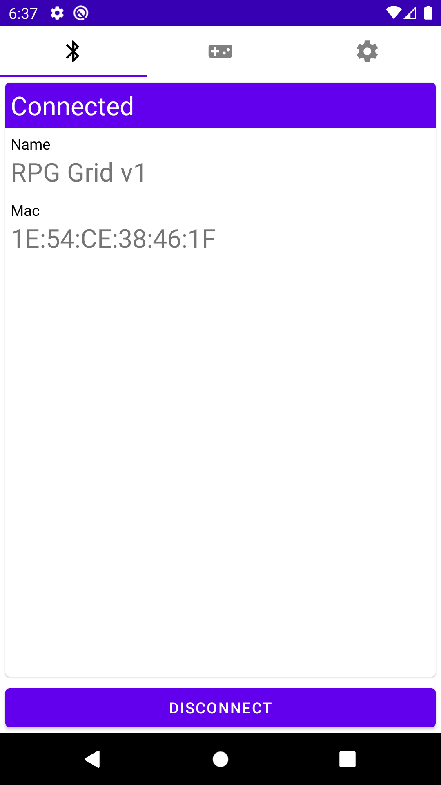
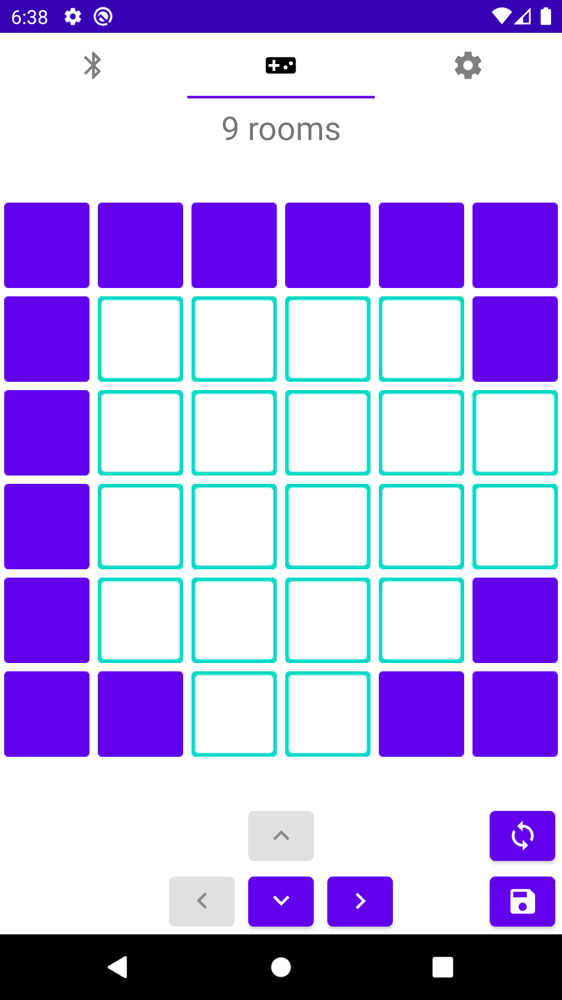
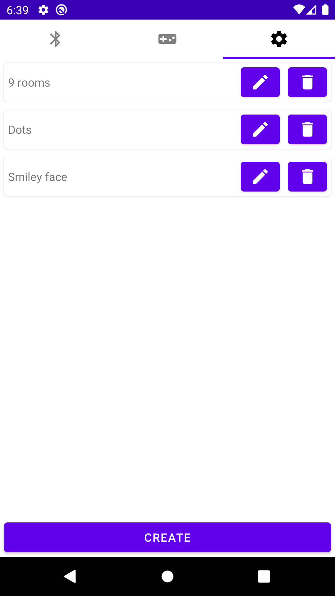

# RPG Grid [](https://circleci.com/gh/Edvinas01/rpg-grid)
Android application to control electrochromic display based, role-playing game 
board. The hardware code can be found on [Arduino project].

<p align="center">
  
  
  
</p>

## Prerequisites
To build this project, the following tools are required:
* [JDK 8] or greater.
* [Intellij IDEA] with [Android Support] plugin.
* Android SDK (this is setup via [Android Support] plugin).
* An Android device with enabled dev mode.

## Running
1. Connect your Android device via USB.
2. Start the `debug-app` run configuration.
3. Select your device.

## Building
Navigate to root project directory and run the following:
```bash
./gradlew assemble
```

After this is done, navigate to `app/build/outputs/apk/release` and grab the 
APK files.

## Gotchas
* Sometimes the project might not compile even though there are no compilation 
issues. If this happens run `./gradlew clean`. If this doesn't help, try 
invalidating [Intellij IDEA] caches and restart.
* If after opening the project nothing works, perform a Gradle refresh and 
after that is done, restart the IDE.

[JDK 8]: https://openjdk.java.net/install
[Intellij IDEA]: https://www.jetbrains.com/idea
[Arduino project]: https://github.com/mta19733/rpg-grid-hw
